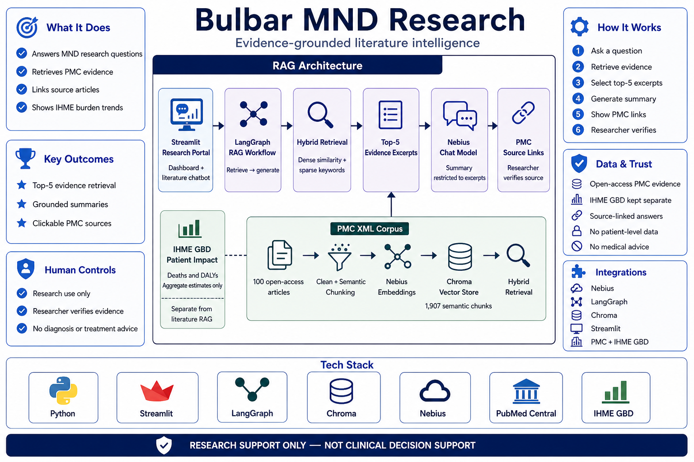

# Bulbar MND research dashboard and RAG

This project downloads open-access PMC XML articles, creates a local Chroma vector index using Nebius embeddings, and provides a Streamlit dashboard and cited literature chatbot.

## Architecture at a glance



## Setup

1. Create the uv-managed project environment:

   ```bash
   uv sync
   ```

2. Create `.env` from `.env.example`, then add your Nebius API key. Do not put the key in Python files or commit `.env`. The default endpoint and models use Nebius Token Factory's OpenAI-compatible API; adjust the model names if your Nebius account provides different ones.

3. Download the articles:

   ```bash
   python mnd_data_extract.py
   ```

   XML files are saved in `data/pmc_xml`.

4. Build the local vector index:

   ```bash
   uv run python rag_app.py index
   ```

   To inspect the recursive chunks first, without calling Nebius:

   ```bash
   uv run python rag_app.py preview-chunks --limit 5
   ```

   To compare semantic chunks, which uses Nebius embeddings to find likely topic
   boundaries, run:

   ```bash
   uv run python rag_app.py preview-chunks --strategy semantic --limit 5
   ```

   Semantic chunks have a 3,500-character safety limit, but do not use the
   recursive splitter's fixed size or overlap settings.

   If the semantic results are better for your questions, rebuild the index with
   that same strategy:

   ```bash
   uv run python rag_app.py index --strategy semantic
   ```

5. Ask a question:

   ```bash
   uv run python rag_app.py ask "What clinical features are reported for bulbar-onset MND?"
   ```

The answer is restricted to retrieved text, summarized without inline citations, and ends with clickable PubMed Central article links. It is for literature research only, not clinical decision-making.

Retrieval is hybrid: Nebius dense-vector similarity is combined with a local keyword score. This helps precise terms, abbreviations, and numeric technical questions while retaining semantic matching.

## Problem, baseline, and success measure

The audience is an MND learner or research user who needs a precise finding from a large set of papers. The present-day pain is passage discovery: a dense-only search can find the right article but miss the exact passage needed to answer a numeric question.

The initial measurable baseline is **top-5 evidence task completion**. A task is complete when one of the five excerpts contains the expected source and all of the evidence terms needed for the answer. On the fixed SNR question documented in [the evaluation baseline](EVALUATION_BASELINE.md), dense-only retrieval ranked the exact passage **8th**, outside the five excerpts: **0/1 tasks completed (0%)**. The current hybrid retriever retains that passage in the top five: **1/1 completed (100%)** on this seed smoke test.

The seed result is not a general accuracy claim (`n=1`). The deployment target is to measure the same binary unit on 20–30 fixed questions and reach at least **90% top-5 evidence task completion**, while checking source-link accuracy separately. Re-run the reproducible smoke test with:

```bash
uv run python evaluate_retrieval.py
```

This project has not yet claimed a human time baseline; a timed user study can be added later without changing the retrieval metric.

## One-command validation

After creating `.env` from `.env.example` and adding `NEBIUS_API_KEY`, run the complete local validation pipeline:

```bash
./run_all.sh
```

This synchronizes dependencies, ensures the 100-article PMC corpus, builds the semantic index when needed, and runs the dense-versus-hybrid retrieval benchmark. Add `--rebuild` to force a fresh index or `--serve` to launch the Streamlit dashboard after validation:

```bash
./run_all.sh --rebuild --serve
```

## Optional LangSmith tracing

LangSmith traces the LangGraph retrieve → generate workflow automatically when enabled. Create an API key in [LangSmith](https://smith.langchain.com/), then add the following to your local `.env` file:

```text
LANGSMITH_TRACING=true
LANGSMITH_API_KEY=your_langsmith_api_key
LANGSMITH_PROJECT=als-mnd-knowledge-chatbot
```

Run the chatbot as usual and inspect the traces in the named LangSmith project. Do not commit the API key. Traces can contain user questions and retrieved research excerpts, so enable them only when that sharing is appropriate.


## Streamlit dashboard

Start the application after indexing:

```bash
uv run streamlit run streamlit_app.py
```

The **Patient impact** tab presents MND deaths and disability-burden estimates from a prepared IHME GBD export, with filters for measure, region, age group, sex, year, and COVID era.

The prepared data uses these columns:

```text
region,age_group,sex,year,measure,value,source
```

Save the prepared export as `data/mnd_burden.csv`. The app does not estimate burden from the PMC papers. The **Literature chatbot** tab answers questions using the indexed corpus and cites its XML sources.

### Loading public MND estimates from IHME GBD

The dashboard uses an export from the [IHME GBD Results tool](https://vizhub.healthdata.org/gbd-results/). Select **Motor neuron disease**, **Number**, the desired measures (for example Deaths and DALYs), locations, age groups, sexes, and years. Convert it once for direct in-app use:

```bash
uv run python prepare_gbd_data.py IHME-GBD_2021_DATA.csv
```

This preserves IHME's estimated prevalence counts and records the source in the dashboard. Use “COVID era and later” for 2020 onward; this is not necessarily the same as the post-pandemic period.
